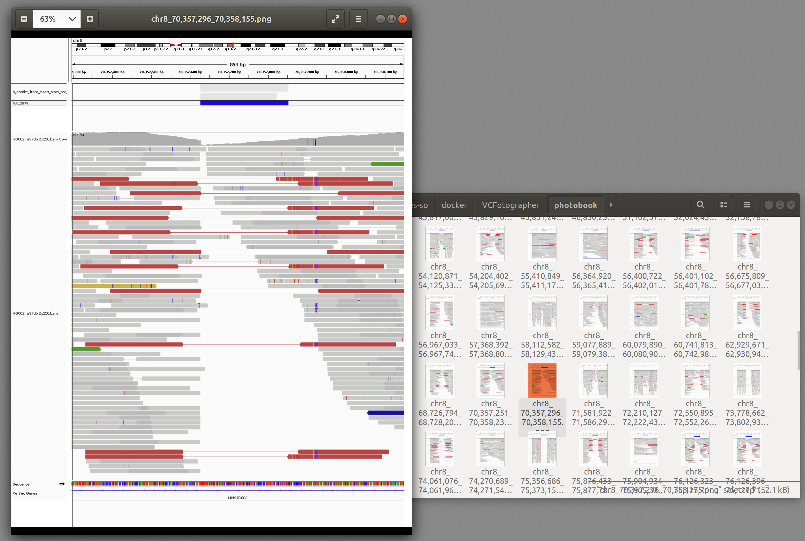

# VCFotographer

This is a tool built around [IGV](https://github.com/igvteam/igv) to automate the process of screenshot generation of regions around variants from a VCF file.

## Build

A Dockerfile is provided in order to create a Docker image and run the application in a container.

```
git clone https://github.com/rick-heig/vcfotographer.git
cd vcfotographer
docker build -t rwk/vcfotographer .
```

## Run

The basic run command shown below will print the usage.

```
docker run rwk/vcfotographer vcfotographer
```

The arguments to vcfotographer can be passed at the end of the command.

```
docker run rwk/vcfotographer vcfotographer [arguments]
```

In order to provide the files to VCFotographer it is suggested to mount a volume on the Docker container.

```
docker run --user $(id .u):$(id -g) -v /home/rick/genomicsFolder:/usr/input:ro -v /home/rick/outputFolder:/usr/output -t rwk/vcfotographer vcfotographer -i /usr/input/myVCF.vcf -b /usr/input/myBAM.bam --output-dir /usr/output/myPhotobook
```

In the command above two [volumes](https://docs.docker.com/storage/volumes/) are mounted with the `-v` argument to docker run. One volume serves to provide the input files and is mounted with the `ro` read-only option. The second volume is for the output photobook. The docker container is run with the same user id and group that launched the docker run command in order for the written files to be created with this user and group. The final arguments are provided to the VCFotographer tool itself and the possible options are listed below.

### Usage

```
                 IMPRECISE;SVTYPE                  VCFotographer
      FILTER   length,assembly=hg19                  
    QUAL   BL  PQ                fileDate=2020     Author : Rick Wertenbroek
  INFO      1KGP    SVLEN=+42;              FILE     
  ID              REF       PASS      VCF     ZU   If you use VCFotographer
                BQ   0/1      PASS                 in your research please
              SB   ok           PASS               cite :
             AA  cG               del
            DB  :O                 ins             @online{wertenbroek2020vcfotographer,
            MQ  .                  dup                 author = {Rick, Wertenbroek},
            GL                     inv                 title = {VCFotographer, an automated tool for genomic variant capture},
             MQ                   cnv                  year = {2020},
              ALT                bnd                   url = {https://github.com/rick-heig/vcfotographer}
                ook            PASS                }
                  END       PASS
  NS                VALIDATED'                GT
  GCCACNACGCCTGGCTAATT-----TATTTTTACTAGAGACGGGGT
    TATAAAACNANACTTCAGAATTACCATAATATTGATTACAAT


  
14:29:58.475 [main] INFO Log - VCFotographer version 0.1.0-SNAPSHOT
Usage: vcfotographer -i variant.vcf -b reads.bam [--scaling factor] [-a additional_track] [--output-dir output_directory]

    Additional tracks - Can be of any type supported by IGV, big file may slow IGV down

```

## Screenshot

The resulting photobook will contain the screenshots in `.png` format named after their position in the genome.



## Citation

If you use VCFotographer in your research please cite :

```
@online{wertenbroek2020vcfotographer,
    author = {Rick, Wertenbroek},
    title = {VCFotographer, an automated tool for genomic variant capture},
    year = {2020},
    url = {https://github.com/rick-heig/vcfotographer}
}
```

## TODO

- Strategy for multiple VCF files : 
  - Should all the screenshots go in the same folder ?
  - Should the variants be sorted ?
  - Should the overlapping variants be merged ?
- Choose how to scale insertions structural events (based on their size or simply some bases around the insertion point)
- Create missing index files, the BAM files passed as argument may not be indexed
